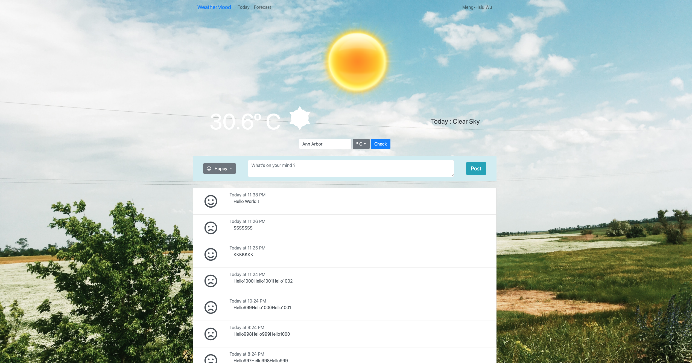

# Weathermood (ReactJS + ExpressJS + PostgreSQL)

After clone the project to local, to run WeatherMood
- Please "npm install" in client & server respectively first to get all the package that project may used.
- Change API key to your own.(client/src/api/open-weather-map.js).
- In server directory, create "env.sh" file and use "source ./env.sh" command to set up the database environment variable. (Default Database Name: "weathermood")
- "npm run start" in client & server directory respectively

### Today's WeatherMood

### Forecast's WeatherMood (Weather for Next 5 days)
